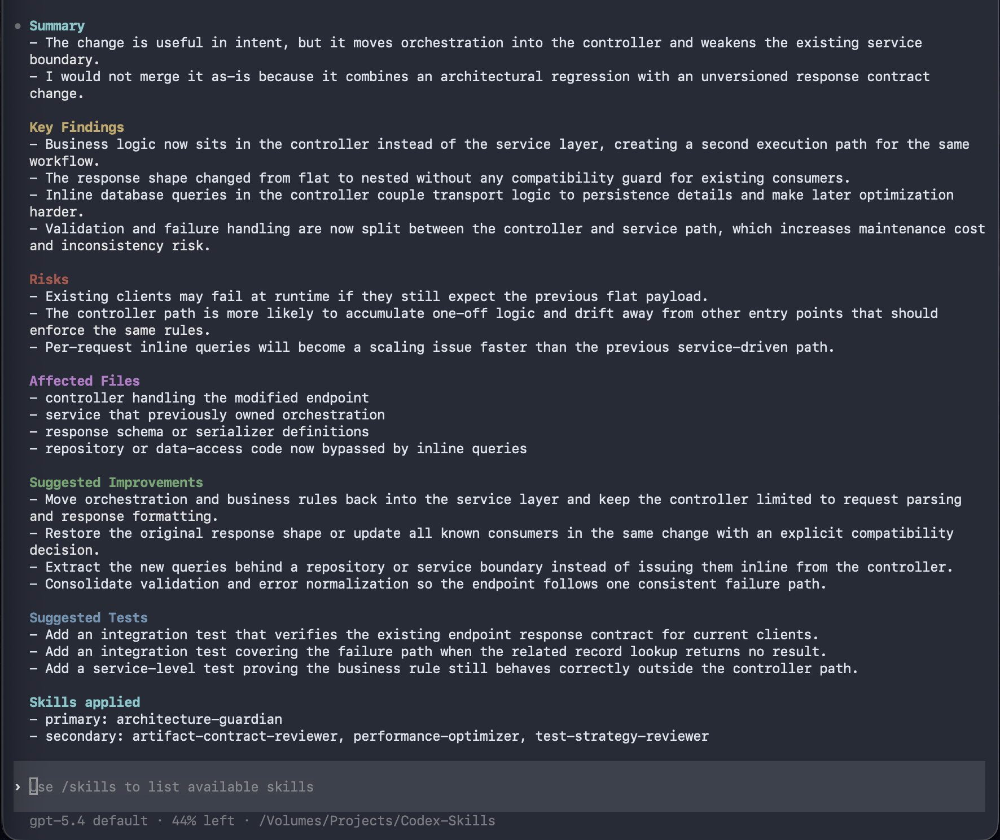

# AI-Engineering-Playbook


[](./LICENSE)


AI can write code.  

This makes it behave like an engineer.

AI-Engineering-Playbook is a governance framework for Codex and similar AI coding agents.

It makes AI-assisted implementation, refactoring, and review behave more like disciplined senior engineering - structured, consistent, and risk-aware.

It is not a tool you run. It is a layer you add.

---

## Demo

This is what a structured, senior-level AI code review should look like.



> Example output using presentation-optimized mode with enforced structure and readability.

---

## What This Repository Provides

- a reusable [`AGENTS.md`](./AGENTS.md) for repository-level governance  
- a portable skill system under [`skills/`](./skills)  
- a generic workflow playbook in [`skills/PLAYBOOK.md`](./skills/PLAYBOOK.md)  
- templates in [`templates/`](./templates) for adapting the framework safely  
- example overlays in:
  - [`examples/security-workflow/`](./examples/security-workflow)  
  - [`examples/backend-service/`](./examples/backend-service)  
  - [`examples/data-pipeline/`](./examples/data-pipeline)  

---

## Why This Exists

AI coding tools often produce inconsistent results.

They can be:
- vague  
- overly permissive  
- disconnected from repository boundaries  

This framework enforces structure, discipline, and review quality without coupling governance into runtime code.

---

## Who This Is For

- engineers using AI coding tools in real repositories  
- teams doing PR reviews with AI assistance  
- people building internal AI development workflows  
- advanced users who want governance, not beginner tutorials  

---

## What This Repository Is Not

- not runtime code  
- not an SDK  
- not a beginner tutorial  
- not a deployable service, library, or CI integration  

---

## Quickstart

1. Copy [`AGENTS.md`](./AGENTS.md) into the target repository root  
2. Copy [`skills/`](./skills) into the target repository  
3. Copy and customize files from [`templates/`](./templates)  
4. Add repo-specific rules (architecture, safety, contracts) into `AGENTS.md`  
5. Keep the core generic - move domain-specific logic into overlays or custom skills  
6. Run one test review using `AGENTS.md` and `skills/PLAYBOOK.md`  
7. Refine only after observing real behavior on a PR or refactor  

Versioning note: this framework is versionless by design, but you can pin a snapshot by copying it into your repo.

---

## Conceptual Flow

```
User Repo
  -> AGENTS.md
  -> skills/
  -> PLAYBOOK.md
  -> AI coding agents (Codex and similar)
  -> consistent implementation and review behavior
```

---

## Before Vs After

Without this framework:

> Looks fine overall. Maybe add a test.

With this framework:

```
Summary
- The change is directionally correct, but it shifts ownership into the CLI layer and weakens the existing contract boundary.

Key Findings
- Business logic moved into presentation code, creating a second orchestration path.
- Payload shape changed without updating downstream consumers.

Risks
- Hidden regression risk in production paths expecting the previous contract.

Suggested Improvements
- Move orchestration back into the service layer.
- Restore contract compatibility or update all consumers in the same change.

Suggested Tests
- Add one regression test for the old contract and one integration test for the new path.

Skills applied
- primary: architecture-guardian
- secondary: artifact-contract-reviewer, test-strategy-reviewer
```

---

## Open Source Design Principles

- generic core  
  - portable governance, playbooks, and reusable skills  

- repo-specific overlays  
  - each repo defines its own architecture, safety rules, and domain logic  

- no runtime coupling  
  - nothing here becomes application code or dependencies  

- structured outputs  
  - reviews and implementations follow explicit, reusable formats  

- strict mode by default  
  - prioritize risk visibility, required improvements, and clarity over permissive summaries  

---

## Output Modes

- Standard structured output (default)
- Presentation-optimized output (for demos and screenshots)

---

## Repository Layout

- [`AGENTS.md`](./AGENTS.md): governance rules for coding agents  
- [`skills/README.md`](./skills/README.md): skill system overview  
- [`skills/PLAYBOOK.md`](./skills/PLAYBOOK.md): workflow-driven skill routing  
- [`skills/*/SKILL.md`](./skills): reusable skills  
- [`templates/`](./templates): adoption templates  
- [`examples/security-workflow/`](./examples/security-workflow): security workflow overlay  
- [`examples/backend-service/`](./examples/backend-service): backend service overlay  
- [`examples/data-pipeline/`](./examples/data-pipeline): data pipeline overlay  


---

## Community

- [`LICENSE`](./LICENSE)  
- [`CONTRIBUTING.md`](./CONTRIBUTING.md)  
- [`CODE_OF_CONDUCT.md`](./CODE_OF_CONDUCT.md)  
