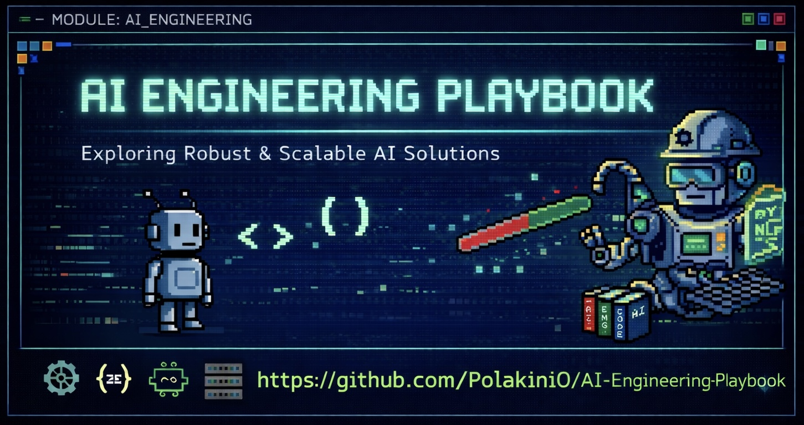
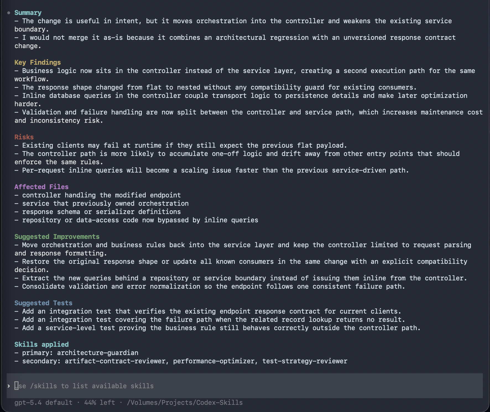

# AI-Engineering-Playbook


[](./LICENSE)


AI can write code.  

This makes it behave like an engineer.

AI-Engineering-Playbook is a governance framework for Codex and similar AI coding agents.

It makes AI-assisted implementation, refactoring, and review behave more like disciplined senior engineering - structured, consistent, and risk-aware.

It is not a tool you run. It is a layer you add.

---

## Demo

This is what a structured, senior-level AI code review should look like.



> Example output using presentation-optimized mode with enforced structure and readability.

---

## What This Repository Provides

- a reusable [`AGENTS.md`](./AGENTS.md) for repository-level governance  
- a portable skill system under [`skills/`](./skills)  
- a generic workflow playbook in [`skills/PLAYBOOK.md`](./skills/PLAYBOOK.md)
- an idea-to-project engineering skill family covering design, deployment, security, operations, and FinOps
- templates in [`templates/`](./templates) for adapting the framework safely
- two focused product bundles for free distribution in [`products/`](./products)
- example overlays in:
  - [`examples/security-workflow/`](./examples/security-workflow)  
  - [`examples/backend-service/`](./examples/backend-service)  
  - [`examples/data-pipeline/`](./examples/data-pipeline)  

---

## Why This Exists

AI coding tools often produce inconsistent results.

They can be:
- vague  
- overly permissive  
- disconnected from repository boundaries  

This framework enforces structure, discipline, and review quality without coupling governance into runtime code.

## Product Bundles And Distribution

The repository remains free and MIT-licensed. The generated [`dist/agent-skills/`](./dist/agent-skills) directory is the clean, frontmatter-compliant distribution surface for compatible agent-skill tools.

The public product catalog groups the skills into:

- **Production Code Review Guardrails** - architecture, contracts, safety, and testing
- **AI Engineering Delivery Playbook** - project planning, security, deployment, operations, finance, and orchestration

See [`products/README.md`](./products/README.md) for the bundle strategy and [`products/MARKETPLACE-SUBMISSIONS.md`](./products/MARKETPLACE-SUBMISSIONS.md) for the free-directory submission plan.

### Free distribution

[](https://skills.sh/PolakiniO/AI-Engineering-Playbook)

The skills.sh badge reports the platform's anonymous CLI install count. Other
free directories are tracked in [`products/DISTRIBUTION-STATUS.md`](./products/DISTRIBUTION-STATUS.md)
without invented download numbers until each platform provides a public
per-repository metric.

---

## Who This Is For

- engineers using AI coding tools in real repositories  
- teams doing PR reviews with AI assistance  
- people building internal AI development workflows  
- advanced users who want governance, not beginner tutorials  

---

## What This Repository Is Not

- not runtime code  
- not an SDK  
- not a beginner tutorial  
- not a deployable service, library, or CI integration  

---

## Quickstart

1. Copy [`AGENTS.md`](./AGENTS.md) into the target repository root  
2. Copy [`skills/`](./skills) into the target repository  
3. Copy and customize files from [`templates/`](./templates)  
4. Add repo-specific rules (architecture, safety, contracts) into `AGENTS.md`  
5. Keep the core generic - move domain-specific logic into overlays or custom skills  
6. Run one test review using `AGENTS.md` and `skills/PLAYBOOK.md`  
7. Refine only after observing real behavior on a PR or refactor  

### Optional: Portable Slash Commands

Repositories can define shorthand commands such as `/codex-install` in `AGENTS.md` as explicit skill-routing aliases.

Example:

- `/codex-install` -> `skill-installer` (install a skill from curated options or from a GitHub repository path)

Keep slash aliases governance-only (agent workflow behavior), not runtime product behavior.

Behavior:

- Defining `/codex-install` in `AGENTS.md` does **not** by itself copy files into other repositories.
- It only tells Codex which skill to use for that turn.
- The actual cross-repo install happens when `skill-installer` pulls from a portable source (such as a public GitHub repository path).

### Skills Catalog

The canonical source under [`skills/`](./skills) stays vendor-neutral.

Tool-specific packaging lives in generated distributions. For Codex, export artifacts into [`dist/codex-skills/`](./dist/codex-skills) with:

```bash
python3 scripts/export-codex-skills.py
```

Install any single generated skill from a local checkout:

```bash
bash scripts/setup-codex-skill.sh --skill <skill-name>
```

If the skill is already installed, add `--force` to replace the existing copy.

Install any single generated skill from GitHub:

```bash
python3 ~/.codex/skills/.system/skill-installer/scripts/install-skill-from-github.py \
  --repo PolakiniO/AI-Engineering-Playbook \
  --path dist/codex-skills/<skill-name>
```

Invoke an installed skill in Codex with `$skill-name`:

```text
Use $project-engineer to turn this idea into the simplest feasible project.
```

| Skill | Purpose | Local install | Codex use |
| --- | --- | --- | --- |
| [`architecture-guardian`](./skills/architecture-guardian/README.md) | Guard boundaries, ownership, and layering. | `bash scripts/setup-codex-skill.sh --skill architecture-guardian` | `Use $architecture-guardian to review this change for boundary drift, ownership issues, and layering problems.` |
| [`artifact-contract-reviewer`](./skills/artifact-contract-reviewer/README.md) | Protect schema and interface contracts. | `bash scripts/setup-codex-skill.sh --skill artifact-contract-reviewer` | `Use $artifact-contract-reviewer to review this change for schema, payload, and downstream contract risk.` |
| [`codex-agent-orchestration`](./skills/codex-agent-orchestration/README.md) | Orchestrate project Codex subagents. | `bash scripts/setup-codex-agent-orchestration-skill.sh` | `Use $codex-agent-orchestration to set up and run a project Codex subagent team.` |
| [`deployment-engineer`](./skills/deployment-engineer/README.md) | Plan simple, safe deployment paths. | `bash scripts/setup-codex-skill.sh --skill deployment-engineer` | `Use $deployment-engineer to plan the simplest feasible deployment path, including environments, release steps, rollback, and verification.` |
| [`finance-engineer`](./skills/finance-engineer/README.md) | Minimize feasible project and cloud costs. | `bash scripts/setup-codex-skill.sh --skill finance-engineer` | `Use $finance-engineer to review this project for lowest feasible cost, budget controls, cleanup plans, and FinOps risk.` |
| [`llm-output-reviewer`](./skills/llm-output-reviewer/README.md) | Review prompts and model-driven behavior. | `bash scripts/setup-codex-skill.sh --skill llm-output-reviewer` | `Use $llm-output-reviewer to review this change for prompt behavior, output validation, and fallback risks.` |
| [`operations-engineer`](./skills/operations-engineer/README.md) | Prepare projects for basic operations. | `bash scripts/setup-codex-skill.sh --skill operations-engineer` | `Use $operations-engineer to review this project for observability, recovery, runbooks, support burden, and launch readiness.` |
| [`performance-optimizer`](./skills/performance-optimizer/README.md) | Optimize performance-critical changes safely. | `bash scripts/setup-codex-skill.sh --skill performance-optimizer` | `Use $performance-optimizer to review this change for latency, throughput, caching, and duplicate-work issues.` |
| [`playbook-installer`](./skills/playbook-installer/README.md) | Onboard repositories to the playbook safely. | `bash scripts/setup-codex-skill.sh --skill playbook-installer` | `Use $playbook-installer to onboard this repository to the AI-Engineering-Playbook safely and incrementally.` |
| [`product-designer`](./skills/product-designer/README.md) | Design specific, polished product experiences. | `bash scripts/setup-codex-skill.sh --skill product-designer` | `Use $product-designer to turn this idea or interface into a specific, polished, implementation-ready product design.` |
| [`project-engineer`](./skills/project-engineer/README.md) | Turn ideas into feasible project plans. | `bash scripts/setup-codex-skill.sh --skill project-engineer` | `Use $project-engineer to turn this idea or design into the simplest feasible project with design, deployment, security, operations, and cost guidance.` |
| [`security-engineer`](./skills/security-engineer/README.md) | Review security and tool reuse decisions. | `bash scripts/setup-codex-skill.sh --skill security-engineer` | `Use $security-engineer to review this plan or tool choice for security, permissions, secrets, supply-chain risk, and required scans.` |
| [`scope-safety-guard`](./skills/scope-safety-guard/README.md) | Enforce safety and external-effect boundaries. | `bash scripts/setup-codex-skill.sh --skill scope-safety-guard` | `Use $scope-safety-guard to review this change for permission, side-effect, and safety-boundary risks.` |
| [`test-strategy-reviewer`](./skills/test-strategy-reviewer/README.md) | Define the minimum safe verification bar. | `bash scripts/setup-codex-skill.sh --skill test-strategy-reviewer` | `Use $test-strategy-reviewer to define the minimum safe test plan and regression coverage for this change.` |

Useful grouped installs:

```bash
# Default: install only playbook-installer
bash scripts/setup-codex-skill.sh

# Install all project engineering role skills
bash scripts/setup-codex-skill.sh --all-project-engineering

# Install every generated skill
bash scripts/setup-codex-skill.sh --all-skills

# List all installable generated skills
bash scripts/setup-codex-skill.sh --list-skills
```

### Install And Use In Codex

Versioning note: this framework is versionless by design, but you can pin a snapshot by copying it into your repo.

After installing a skill, restart Codex if it does not appear immediately.

After restart:

- use `/skills` to view or enable installed skills
- do not expect custom skills to appear in the `/` slash-command palette
- look for the skill display name in the skills list
- invoke explicitly with `$skill-name`

Example:

```text
Use $playbook-installer to onboard this repository to the AI-Engineering-Playbook.
```

Idea-to-project example:

```text
Use $project-engineer, $product-designer, $deployment-engineer, $security-engineer, $operations-engineer, and $finance-engineer to turn this idea into the simplest feasible shipped project.
```

Agent orchestration example:

```text
Use $codex-agent-orchestration to set up and run a project Codex subagent team.
```

### Troubleshooting: `skill-installer`

If `skill-installer` appears to do nothing (for example after entering a partial input like `Implemen`), use this exact sequence.

#### Quick path

This repository includes a wrapper script:

```bash
bash scripts/setup-codex-skill.sh
```

If the generated path exists locally, the script installs directly from your local `dist/codex-skills/...` tree. Otherwise it falls back to this repository's `origin` remote, or `PolakiniO/AI-Engineering-Playbook` if no GitHub `origin` is configured.

Install all project engineering skills:

```bash
bash scripts/setup-codex-skill.sh --all-project-engineering
```

Install only the Codex agent orchestration skill:

```bash
bash scripts/setup-codex-agent-orchestration-skill.sh
```

Install a single playbook skill by name:

```bash
bash scripts/setup-codex-skill.sh --skill deployment-engineer
```

To replace an already installed skill during local iteration:

```bash
bash scripts/setup-codex-skill.sh --force
```

Override the source skill:

```bash
bash scripts/setup-codex-skill.sh \
  --repo PolakiniO/AI-Engineering-Playbook \
  --skill playbook-installer \
  --ref main

# Optional: if your Codex install lives in a custom location
INSTALLER_SCRIPT="/custom/path/install-skill-from-github.py" bash scripts/setup-codex-skill.sh
```

The setup script auto-discovers the installer in common locations under `/opt/codex/skills` and `$CODEX_HOME/skills` before falling back to `INSTALLER_SCRIPT`.

#### 1) List available skills first (copy exact names)

```bash
python3 ~/.codex/skills/.system/skill-installer/scripts/list-skills.py
```

Copy an exact skill name from the output.

#### 2) Install using an exact path (not a partial name)

```bash
python3 ~/.codex/skills/.system/skill-installer/scripts/install-skill-from-github.py \
  --repo PolakiniO/AI-Engineering-Playbook \
  --path dist/codex-skills/<exact-skill-name>
```

Example:

```bash
python3 ~/.codex/skills/.system/skill-installer/scripts/install-skill-from-github.py \
  --repo PolakiniO/AI-Engineering-Playbook \
  --path dist/codex-skills/playbook-installer
```

#### 3) If install fails, diagnose by error text

- **`403`, proxy, or tunnel error**  
  Your environment cannot currently reach GitHub API/content endpoints. Retry from a network-enabled shell or configure proxy/token access.
- **`already exists`**  
  The destination skill folder already exists. Remove/rename the existing folder, or re-run `bash scripts/setup-codex-skill.sh --force`.
- **`not found`**  
  The skill name/path is incorrect. Re-run `list-skills.py` and retry with an exact name.

If Codex still reports an invalid `SKILL.md` after reinstalling, check for stale backup folders under `~/.codex/skills/`. A folder like `playbook-installer.bak/` is still scanned as a skill. Move it outside `~/.codex/skills/` or delete it if it is no longer needed.

#### 4) Restart Codex after successful install

Newly installed skills are loaded on startup, so restart Codex before trying the skill.

---

## Conceptual Flow

```
User Repo
  -> AGENTS.md
  -> skills/
  -> PLAYBOOK.md
  -> AI coding agents (Codex and similar)
  -> consistent implementation and review behavior
```

---

## Before Vs After

Without this framework:

> Looks fine overall. Maybe add a test.

With this framework:

```
Summary
- The change is directionally correct, but it shifts ownership into the CLI layer and weakens the existing contract boundary.

Key Findings
- Business logic moved into presentation code, creating a second orchestration path.
- Payload shape changed without updating downstream consumers.

Risks
- Hidden regression risk in production paths expecting the previous contract.

Suggested Improvements
- Move orchestration back into the service layer.
- Restore contract compatibility or update all consumers in the same change.

Suggested Tests
- Add one regression test for the old contract and one integration test for the new path.

Skills applied
- primary: architecture-guardian
- secondary: artifact-contract-reviewer, test-strategy-reviewer
```

---

## Open Source Design Principles

- generic core  
  - portable governance, playbooks, and reusable skills  

- repo-specific overlays  
  - each repo defines its own architecture, safety rules, and domain logic  

- no runtime coupling  
  - nothing here becomes application code or dependencies  

- structured outputs  
  - reviews and implementations follow explicit, reusable formats  

- strict mode by default  
  - prioritize risk visibility, required improvements, and clarity over permissive summaries  

---

## Output Modes

- Standard structured output (default)
- Presentation-optimized output (for demos and screenshots)

---

## Repository Layout

- [`AGENTS.md`](./AGENTS.md): governance rules for coding agents  
- [`PLAYBOOK.md`](./PLAYBOOK.md): root-level pointer to the canonical playbook  
- [`skills/README.md`](./skills/README.md): skill system overview  
- [`skills/PLAYBOOK.md`](./skills/PLAYBOOK.md): workflow-driven skill routing  
- [`skills/*/SKILL.md`](./skills): reusable skills  
- [`templates/`](./templates): adoption templates  
- [`examples/security-workflow/`](./examples/security-workflow): security workflow overlay  
- [`examples/backend-service/`](./examples/backend-service): backend service overlay  
- [`examples/data-pipeline/`](./examples/data-pipeline): data pipeline overlay  


---

## Community

- [`LICENSE`](./LICENSE)  
- [`CONTRIBUTING.md`](./CONTRIBUTING.md)  
- [`CODE_OF_CONDUCT.md`](./CODE_OF_CONDUCT.md)  
